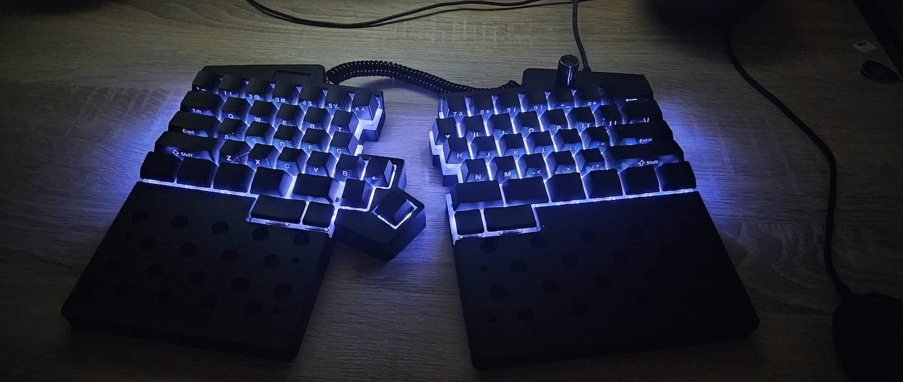
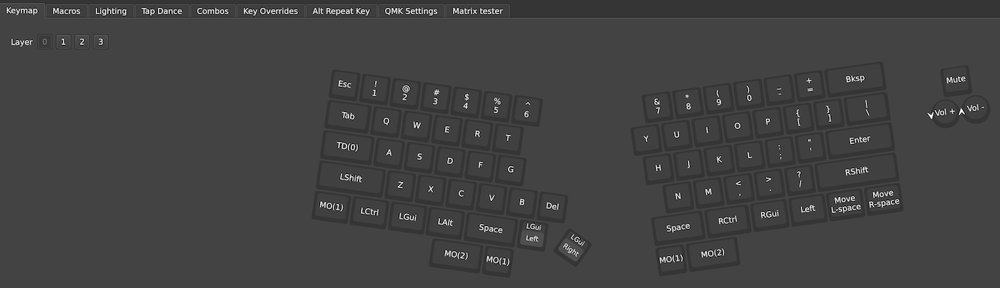
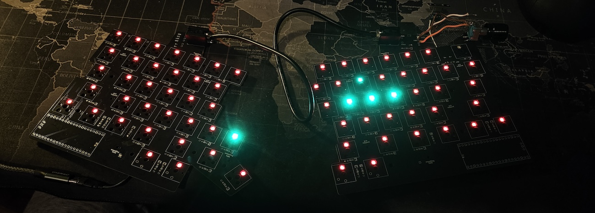
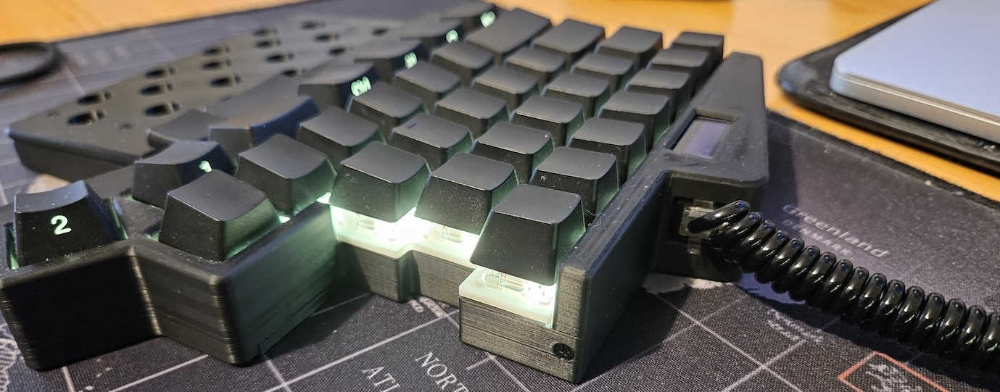
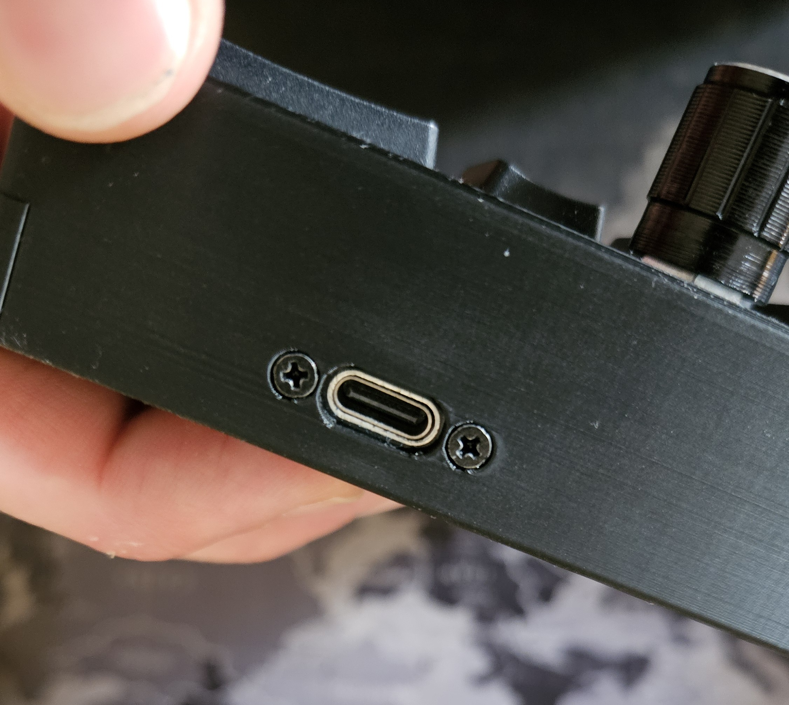
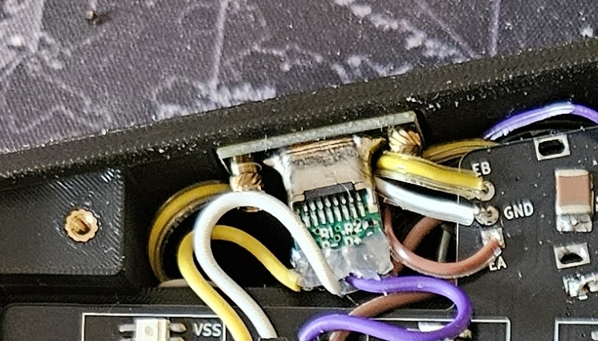
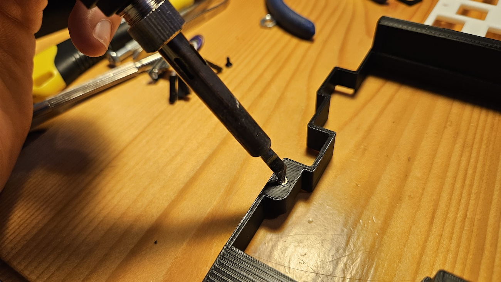
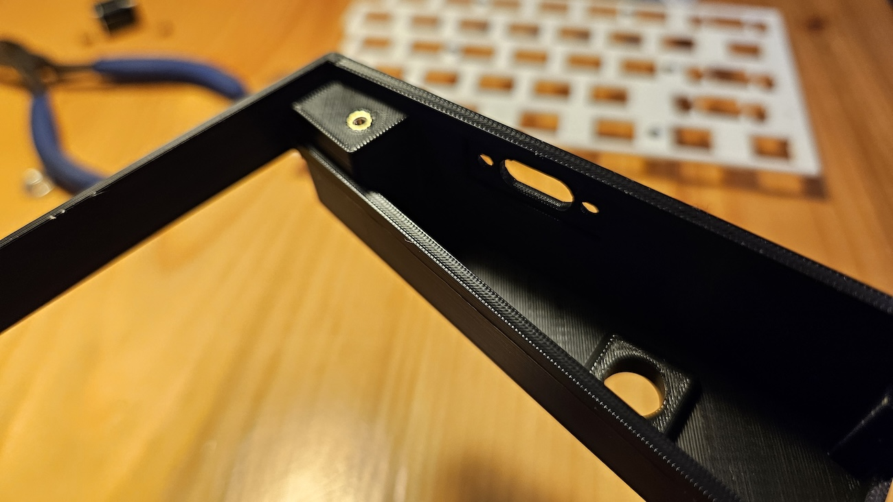
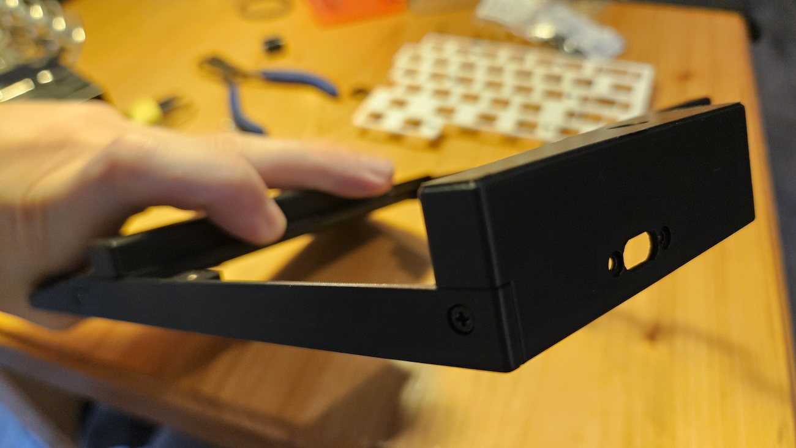

# SPLIT KEYBOARD (my second version)



## ⚠️ Report In Progress ⚠️
This project details the design and construction of my first custom split keyboard. The build features a custom PCB, hand-soldered components, and a 3D-printed case, all powered by the Raspberry Pi Pico and QMK firmware.

**Key Features:**
- **Microcontroller**: Raspberry Pi Pico (RP2040)
- **Firmware**: QMK with Vial GUI support
- **Switches**: Hot-swappable MX switches
- **Displays**: OLED status screens
- **Input**: Rotary encoders
- **Interconnect**: RJ11 cabling for safe hot-plugging

The layout is a traditional row-staggered design (non-ortholinear) with ergonomic enhancements:
- **Inner Macro Keys**: 3 extra keys on the inner side of the right half.
- **Thumb Cluster**: 2 low-profile keys under each spacebar, primarily used as layer modifiers.

*Acknowledgments: Special thanks to the QMK and Vial communities, and the authors of the Sofle Pico keyboard, whose work provided invaluable inspiration and knowledge.*

## Components List
- Custom PCBs (Left & Right)
- 2x Raspberry Pi Pico
- 1N4148 Diodes
- Kailh Hot-swap Sockets
- SK6812MINI-E SMD LEDs
- EC11 Rotary Encoders
- 0.91" I2C OLED Displays
- RJ11 Jacks (6P6C or similar)
- Brass Standoffs (M2)

## Features & Implementation

### Layout & Ergonomics
The keyboard deviates slightly from a standard 60% ANSI layout to accommodate split ergonomics. It combines standard MX switches with low-profile switches for the thumb cluster to reduce strain. The extra macro keys on the left half provide quick access to custom functions.

### Software (QMK & Vial)
The keyboard runs on QMK firmware and is fully compatible with Vial. This allows for real-time configuration via a graphical interface without re-flashing. Users can program:
- **Layers**: Toggle between different keymaps (e.g., QWERTY, navigation, numpad).
- **Macros**: Automate complex key sequences.
- **Tap Dance**: Assign different actions to a key based on how many times it is tapped.



### Rotary Encoders (EC11)
The keyboard utilizes EC11 rotary encoders. In the QMK ecosystem, encoders provide a fluid input method distinct from binary key presses. They are ideal for continuous values like volume control, page scrolling, or history navigation.

### OLED Displays
Each half is equipped with an OLED display connected via the I2C protocol.


### RGB Backlighting (SK6812MINI-E)
The PCB features per-key RGB backlighting using SK6812MINI-E LEDs.
- **Technology**: These addressable "reverse-mount" LEDs sit within PCB cutouts, shining upwards through the switch housing.
- **Effects**: Powered by QMK's RGB Matrix system, the keyboard supports vast lighting animations, reactive typing effects, and layer-specific color coding (e.g., turning the keyboard red when on the "Function" layer).




## Hardware Details

### Microcontroller: Raspberry Pi Pico (RP2040)
I selected the Raspberry Pi Pico for this build due to its generous GPIO count compared to the Pro Micro. With 26 usable GPIO pins, the RP2040 handles the matrix, encoders, OLEDs, and RGB data lines directly, simplifying the PCB design.

### Split Connection: UART via RJ11
Communication between the two halves uses Full Duplex UART over an RJ11 cable (inspired by the Ultimate Hacking Keyboard).
- **Why RJ11?**: Unlike the common TRRS (Aux) cables used in many split keyboards, RJ11 connectors do not short pins momentarily during insertion or removal. This design choice eliminates the risk of shorting VCC to GND while the keyboard is powered.


I constructed a custom cable using 4-pin RJ11 connectors (6P4C) attached to a 4-core wire. It is crucial to ensure the connectors support at least 4 pins, avoiding the common 2-pin variants typically used for telephone lines in Italy.

### USB Type-C Connectivity
Each keyboard half features a dedicated USB Type-C port for computer connectivity. I chose this standard for its versatility and widespread adoption. The port is distinct from the inter-half connection to prevent accidental mismatches. Either half can be connected to the host computer.
I referenced the Raspberry Pi Pico datasheet to correctly wire the external USB-C breakout board to the microcontroller, ensuring the Pico detects the external connection as its primary USB interface.


## 3D-Printed Case Design
I designed and printed a custom enclosure using PLA. The chassis is modular, divided into multiple parts to:
- Allow for easy replacement of individual components without re-printing the entire case.
- Reduce print time per part (avoiding >20h single prints).

I used a nozzle of 0.2mm diameter for the 3D printing process.

The case uses threaded brass inserts (M2) for a robust and aesthetically pleasing assembly.
PLA proved to be an excellent material choice: it is cost-effective, easy to print, and durable enough for a keyboard that doesn't face extreme thermal or mechanical stress.






## Component Assembly & Soldering
All PCB components were hand-soldered, which included:
- **Raspberry Pi Pico**: Soldering all GPIO pins plus the two small test pads required for the external USB data lines.
- **Passive Components**: 2 capacitors per PCB.
- **Connectors**: External USB-C breakout (4 pins) and RJ11 jacks (4 pins).
- **Peripherals**: Rotary encoders (5 pins) and OLED display headers (4 pins).

For the matrix:
- **Diodes**: 1N4148 diodes for each key (2 points).
- **Sockets**: Kailh hot-swap sockets (2 points) - switches are not soldered directly.
- **LEDs**: SK6812MINI-E SMD LEDs (4 points per key).

A significant challenge was soldering the small voltage level shifter required for correct LED data signaling. As this was my first experience with soldering—especially with such small SMD components—the results are functional but reflect the learning curve involved.

## Flashing Instructions

1. Move this git repository to the `keyboards` directory of `vial-qmk` and rename it to `split_keyboard_gabriele`.
2. Flash the firmware using the following commands:

```bash
# Flash Left Side
qmk flash -kb new_split_keyboard_gabriele -km vial -bl uf2-split-left

# Flash Right Side
qmk flash -kb new_split_keyboard_gabriele -km vial -bl uf2-split-right
```

## References
- [QMK Firmware](https://qmk.fm/)
- [Raspberry Pi Pico Datasheet](https://datasheets.raspberrypi.com/pico/pico-datasheet.pdf)
- [Sofle Pico Split Keyboard](https://www.soflepico.com)
- [Ultimate Hacking Keyboard - blog](https://uhk.io/blog)
- [VIAL](https://blog.4dcu.be/diy/2023/12/03/pi-pico-usb-c.html)
- [Simple USB Type-C Upgrade for the Raspberry Pi Pico](https://blog.4dcu.be/diy/2023/12/03/pi-pico-usb-c.html)
